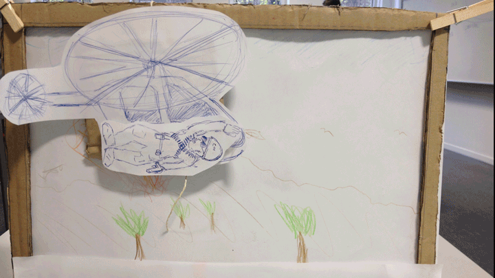
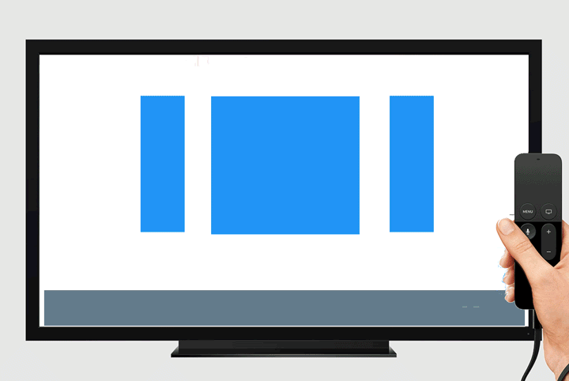

# Share-Your-Monment 

The  "share-your-moment" concept is about sharing little moments of your favorite movies. 

## Getting started 

```

npm install
npm run start 

```
## Keys 

* Use the **Enter** key access all actions. 
* To stop the video you can also use the **spacebar** 

## Live-Demo 

**Important: This app is optimized for a TV-Screen with a width of 1080p**

You can give it a try at our current live version: [Share-Your-Moment](http://share-your-moment.herokuapp.com)


Here are some example moments: 

* https://share-your-moment.herokuapp.com/?start=24.5&ziel=25.54789
* https://share-your-moment.herokuapp.com/?start=275.096676&ziel=278.156864
* https://share-your-moment.herokuapp.com/?start=196.951528&ziel=201.04529


## Design-Process 

### Paper-Prototype 



### Wireframes 


### Live-Video
[](https://www.youtube.com/watch?v=t33bzrQ8KjM&feature=youtu.be)
  


